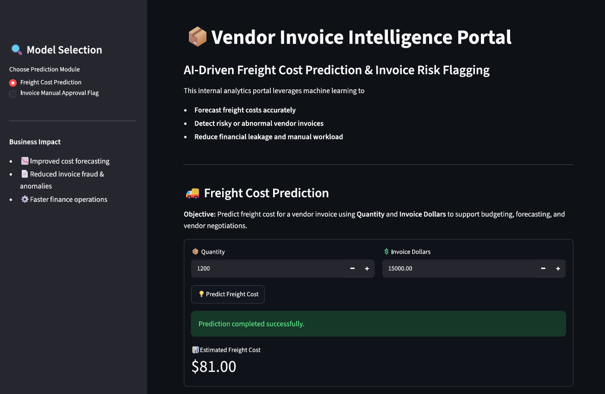
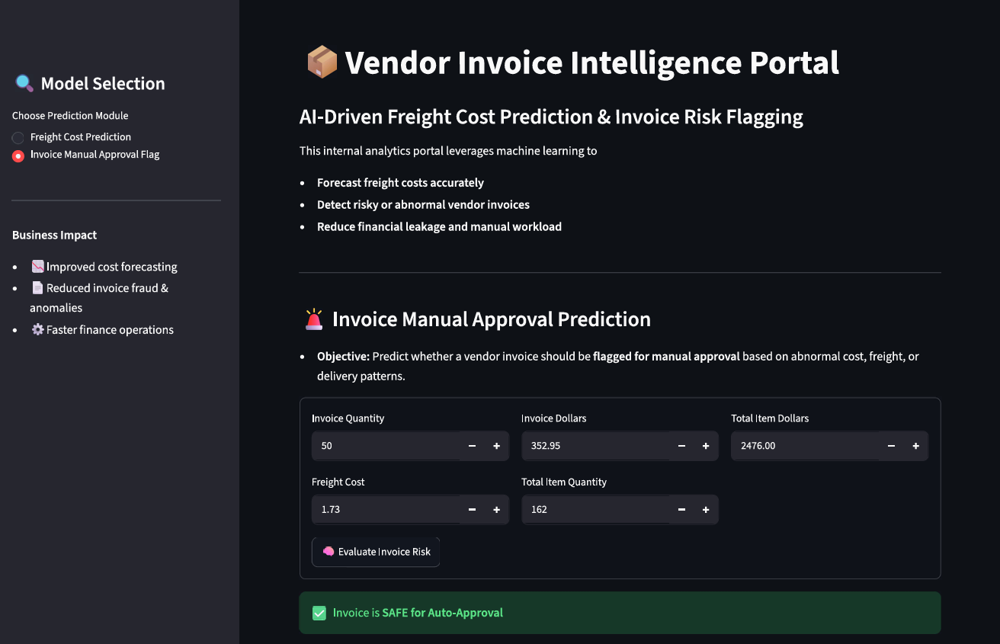

# 🧾Vendor Invoice Intelligence System

**Freight Cost Prediction & Invoice Risk Flagging**


## 📌 Table of Contents
- <a href="#overview">Overview</a>
- <a href="#business-objective">Business Objective</a>
- <a href="#data-source">Data Sources</a>
- <a href="#exploratory-data-analysis-eda">Exploratory Data Analysis (EDA)</a>
- <a href="#models-used">Models Used</a>
- <a href="#metrics">Evaluation Metrics</a>
- <a href="#application">End-to-End Application</a>
- <a href="#project-structure">Project Structure</a>
- <a href="#how-to-run-this-project">How to Run This Project</a>

---
<h2><a class="anchor" id="overview"></a>📌 Overview</h2>

This project implements an **end-to-end machine learning system** designed to support finance teams by:

1. **Predicting expected freight cost** for vendor invoices.
2. **Flagging high-risk invoices** that require manual review due to abnormal cost, freight, or operational patterns.

---
<h2><a class="anchor" id="business-objective"></a>🎯 Business Objective</h2>

<h3>1. Fright Cost Prediction (Regression)</h3>

**Objective:** Predict freight cost for a vendro invoice using quantity and invoice value, to improve budgeting and cost management.
Why it matters:
- It's a non-trivial component of landed cost.
- Poor freight estimates distort margin and inventory management.
- Early prediction improves procurement planning and vendor negotiation



<h3>2. Invoice Risk Flagging (Classification)</h3> 

**Objective:** Predict whether a vendor invoice should be flagged for manual approval due to a abnormal cost, freight, or delivery patterns, in order to reduce financial risk, improve operational efficiency.

Why it matters:
- Manual invoice review is time-consuming and does not scale with transaction volume.
- Abnormal freight charges, pricing deviations, or delivery delays often indicate errors, disputes, or compliance risks.
- An abutomated flagging system enables finance teams to focus attention on high-risk invoices while allowing low-risk invoices to be processed automatically.



---
<h2><a class="anchor" id="data-source"></a>📁 Data Sources</h2>

Data is stored in a relational SQLite database (inventory.db) with the following tables:
- vendor_invoice - Invoice-level financial and timing data
- purchases - Item-level purchase details
- purchase prices - Reference purchase prices
- begin_inventory, end inventory - Inventory snapshots 

SQL aggregation is used to generate invoice-level features.

---

<h2><a class="anchor" id="exploratory-data-analysis-eda"></a>📊 Exploratory Data Analysis (EDA)</h2>


EDA focuses on business-driven questions, such as:
- Do flagged invoices have higher financial exposure?
- Does freight scale linearly with quantity?
- Does freight cost depend on quantity?
Statistical tests (t-tests) are used to confirm that flagged invoices differ meaningfully from normal invoices.
---

<h2><a class="anchor" id="models-used"></a>⚛  Models Used</h2>

Regression (Freight Prediction)
- Linear Regression (baseline) • Decision Tree Regressor
- Random Forest Regressor (final model)

Classification (Invoice Flagging)
- Logistic Regression (baseline)
- Decision Tree Classifier
- Random Forest Classifier (final model with GridSearchCV)

Hyperparameter tuning is performed using GridSearchCV with F1-score to handle class imbalance.

---

<h2><a class="anchor" id="metrics"></a>📈 Evaluation Metrics</h2>

Freight Prediction
- MAE
- RMSE
- R² Score

Invoice Flagging
- Accuracy
- Precision, Recall,F1-score
- Classification report
- Feature imortance analysis

---

<h2><a class="anchor" id="application"></a>💻 End-to-End Application</h2>

A Streamlit application demonstrates the complete pipeline:

- Input invoce details
- Predict expected freight
- Flag invoice in real time
- Provide human - readable explanations

---

<h2><a class="anchor" id="project-structure"></a>📁 Project Structure</h2>

```
Vendor-Invoice-Intelligence-Portal/
│
├── app.py                          # Streamlit web application              
│ 
├── Images/ 
│   ├── Freight_cost_prediction
│   └── Invoice_Manual_Approval_Prediction
│
│
├── models/
│   ├── predict_freight_model.pkl   # Trained freight cost prediction model
│   ├── predict_flag_invoice.pkl    # Trained invoice flagging model
│   └── scaler.pkl                  # Feature scaling object
│
├── freight_cost_prediction/
│   ├── train.py                    # Freight model training pipeline
│   ├── data_preprocessing.py       # Data loading and preprocessing
│   └── modeling_evaluation.py      # Model training and evaluation
│
├── invoice_flag_prediction/
│   ├── train.py                    # Invoice flag model training pipeline
│   ├── data_preprocessing.py       # Feature engineering and preprocessing
│   └── modeling_evaluation.py      # Classification evaluation
│
├── inference/
│   ├── predict_freight.py          # Freight prediction logic
│   └── predict_invoice_flag.py     # Invoice flag prediction logic
│
├── notebooks/
│   ├── freight_eda.ipynb           # Freight cost analysis
│   └── invoice_eda.ipynb           # Invoice risk analysis
│
├── requirements.txt                # Project dependencies
├── README.md                       # Project documentation
└── .gitignore                      # Ignored files and folders
```
---
<h2><a class="anchor" id="how-to-run-this-project"></a>How to Run This Project</h2>

1. Clone the repository:

```bash
git clone https://github.com/yashjadhav0609/Vendor-Invoice-Intelligence-System.git
```

2. Install the required dependencies:

```bash
pip install -r requirements.txt
```

3. Launch the Streamlit application:

```bash
streamlit run app.py
```

4. Open the local URL displayed in the terminal (typically `http://localhost:8501`) to access the Vendor Invoice Intelligence Portal.

5. Enter invoice details and use the dashboard to:

   * Predict freight costs
   * Identify invoices that require manual approval
   * Support finance and procurement decision-making

**Note:** Pre-trained machine learning models are included in the repository, allowing the application to run without retraining.


---
